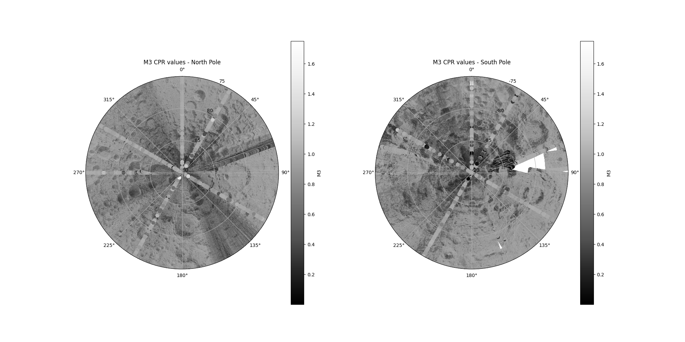
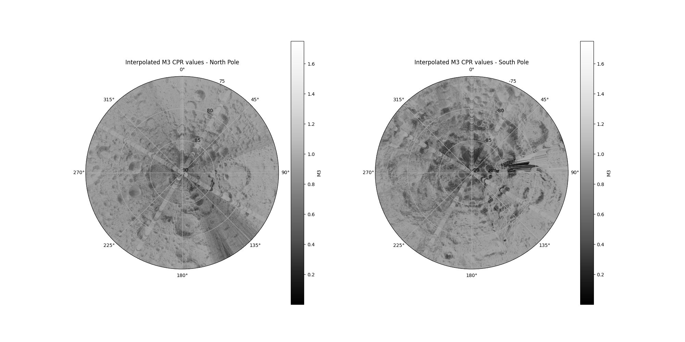
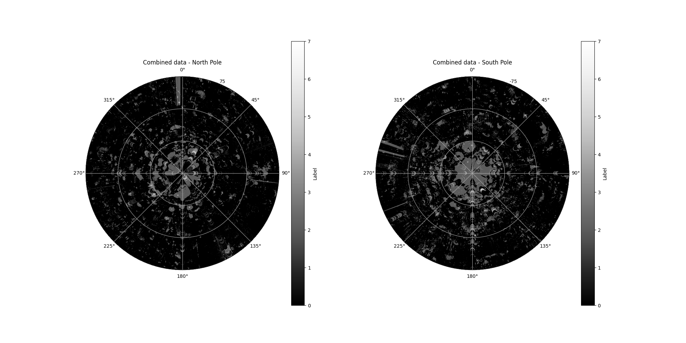

# Using deep learning to map potential resource distribution of lunar permanently shadowed regions

<strong>Independent Research Project by Ardan Suphi (as5023)</strong> 
<strong>MSc in Applied Computational Science and Engineering</strong> 
<strong>Department of Earth Science and Engineering, Imperial College London</strong>

## Project overview
The presence, location, and abundance of volatile substances, such as water ice, on the lunar surface have been subjects of long-standing scientific inquiry and many consider the most likely locations for them as inside permanently shadowed regions (PSRs). Remote sensing has emerged as a valuable tool for estimating these distributions.

This project proposes that the consolidation of several of these remote sensing datasets and the application of machine learning (ML) algorithms can improve the estimates of the presence and
distribution of volatile substances.

The overall goal of this project was to collect, combine and label several of NASA’s remote sensing datasets, then train a machine learning model to score coordinate points on the lunar surface for the presence of voliatiles, based on remote sensing indicators.

As inputs, the model will receive coordinates plus remote sensing values for Diviner, LOLA, M3 and Mini-RF, and output a score between 0 and 7 with the former representing absolutely no indication of volatile material and the later representing the maximum possible indication of such materials.

Datasets were decoded and interpolated and synthetically labelled. The distribution of the labels can be seen in the image below.

    
    
<strong>(a)</strong> Raw Image

    
    
<strong>(b)</strong> Interpolated Image

    
    
<strong>(c)</strong> Label Image

## Project components

## File structure

## Setup
clone the repo
create env
data access

## How to use the model / usage examples 